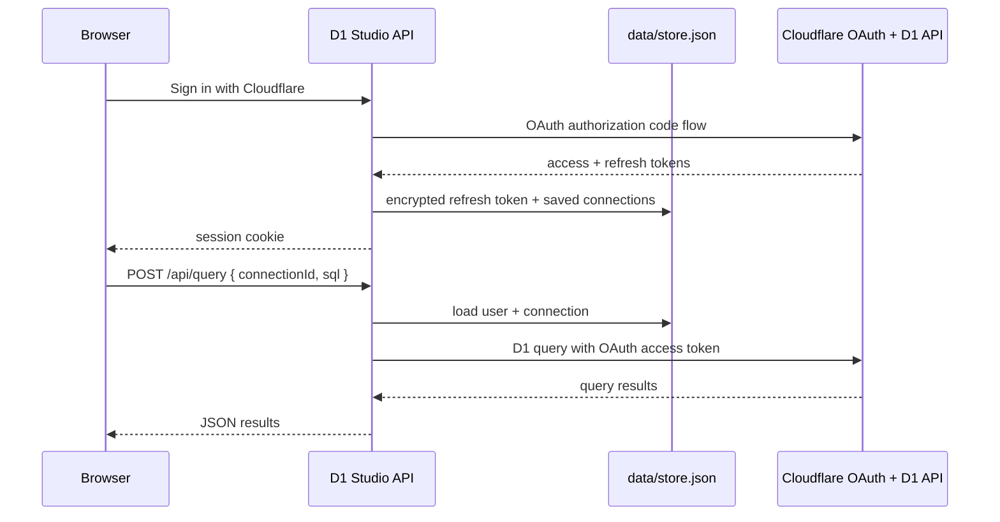

# D1 Studio

A dark-mode web GUI for querying [Cloudflare D1](https://developers.cloudflare.com/d1/) SQLite databases. Built with Next.js, TypeScript, and Tailwind CSS.


## Features

- **Sign in with Cloudflare** — OAuth login; saved databases sync across devices
- **SQL query editor** — Monospace editor with `Ctrl+Enter` / `Cmd+Enter` to execute
- **Multiple database connections** — Pick D1 databases from your Cloudflare account
- **Table browser** — Left sidebar lists tables; click to run `SELECT * … LIMIT 100`
- **Results grid** — Sticky headers, row hover, scrollable output with execution time and row count
- **Export** — Download results as Excel (`.xlsx`), JSON, or CSV
- **Error handling** — Network, auth, and SQL errors shown in the UI

## Quick start

### Prerequisites

- Node.js 20+
- A Cloudflare account with at least one D1 database
- A [Cloudflare OAuth client](https://developers.cloudflare.com/fundamentals/oauth/create-an-oauth-client/) (see setup below)

### 1. Configure OAuth

Copy the example env file and fill in values:

```bash
cp .env.example .env.local
```

| Variable | Description |
|----------|-------------|
| `APP_URL` | Public URL of the app, e.g. `http://localhost:3000` |
| `CLOUDFLARE_OAUTH_CLIENT_ID` | OAuth client ID |
| `CLOUDFLARE_OAUTH_CLIENT_SECRET` | OAuth client secret |
| `SESSION_SECRET` | Random string used to encrypt refresh tokens at rest |

Create an OAuth client in **Cloudflare Dashboard → Manage Account → OAuth clients**:

| Setting | Value |
|---------|--------|
| Grant types | **Authorization Code** and **Refresh Token** (both required) |
| Response type | **Code** (not Token) |
| Redirect URI | `{APP_URL}/api/auth/callback` |
| Scopes (dashboard) | **Account Settings → Read**, **User Details → Read**, **D1 → Read**, **D1 → Write** |
| Scopes (auth URL) | `account-settings.read user-details.read d1.read d1.write` — from [GET /oauth/scopes](https://developers.cloudflare.com/api/resources/iam/subresources/oauth_scopes/methods/list/) |
| Token auth method | `client_secret_post` or `client_secret_basic` |

For use by anyone with a Cloudflare account, set the client visibility to **public** (requires domain verification on your client URL). Private clients only work for members of the OAuth client’s parent account.

### 2. Install and run

```bash
npm install
npm run dev
```

Open [http://localhost:3000](http://localhost:3000) and click **Sign in with Cloudflare**.

### Production build

```bash
npm run build
npm start
```

Use the same `APP_URL` as your deployed hostname so OAuth redirects work on phone and laptop.

### Deploy on Vercel

Vercel serverless functions have a read-only filesystem, so the default `data/store.json` file store does not work in production. Use **Cloudflare Workers KV** instead:

1. In Cloudflare Dashboard: **Workers & Pages → KV → Create namespace** (e.g. `d1-studio`)
2. Copy the namespace ID
3. Create an API token with **Workers KV Storage Read** and **Workers KV Storage Write** on that namespace
4. In Vercel, set:
   - `CLOUDFLARE_ACCOUNT_ID` — your Cloudflare account ID
   - `CLOUDFLARE_KV_NAMESPACE_ID` — the KV namespace ID
   - `CLOUDFLARE_API_TOKEN` — the token from step 3
   - Plus `APP_URL`, OAuth credentials, and `SESSION_SECRET`
5. Redeploy

Local development continues to use `data/store.json` when KV env vars are not set.

**Troubleshooting login on Vercel:** If sign-in fails with a KV authentication / `401` / Cloudflare code `10000` error, OAuth usually succeeded but the app could not read Workers KV. `CLOUDFLARE_API_TOKEN` must be a Cloudflare **API token** with Workers KV Read + Write — not `CLOUDFLARE_OAUTH_CLIENT_SECRET`. Confirm the token’s account matches `CLOUDFLARE_ACCOUNT_ID` and the namespace matches `CLOUDFLARE_KV_NAMESPACE_ID`, then redeploy. Hit `/api/auth/debug` to check KV readiness (`kv.status`: `ok` | `unauthorized` | `unconfigured`) without exposing secrets.

## Usage

### 1. Sign in

Click **Sign in with Cloudflare** and approve access. Your OAuth session persists for 30 days via an httpOnly cookie.

### 2. Add a database

Click **Add Database**, choose an account and D1 database, optionally set a label, then **Add & Connect**.

Saved connections are stored server-side and appear on any device where you sign in with the same Cloudflare account.

### 3. Run queries

- Select a table from the sidebar, or write SQL in the editor
- Click **Execute Query** or press `Ctrl+Enter` / `Cmd+Enter`
- Use the **Export** dropdown to download results

## Architecture

```
src/
├── app/
│   ├── api/
│   │   ├── auth/           # Cloudflare OAuth login, callback, logout, me
│   │   ├── connections/    # Saved database picks (per user)
│   │   ├── d1/             # List accounts & D1 databases
│   │   └── query/          # Proxy D1 queries using server-side OAuth token
│   ├── globals.css
│   ├── layout.tsx
│   └── page.tsx
├── components/
│   ├── DatabasePickerModal.tsx
│   ├── D1Studio.tsx
│   ├── DataGrid.tsx
│   ├── ErrorBanner.tsx
│   ├── ExportDropdown.tsx
│   ├── QueryEditor.tsx
│   ├── StatusBar.tsx
│   └── TableSidebar.tsx
├── lib/
│   ├── server/             # OAuth, session, encrypted token store
│   ├── d1-api.ts           # Client query helpers
│   ├── export-data.ts
│   └── studio-api.ts       # Client API for auth & connections
└── types/
    └── d1.ts
```

### Auth and storage flow



### D1 API integration

The browser calls `/api/query` with a `connectionId`. The server looks up the account/database IDs, obtains a valid OAuth access token (refreshing if needed), and proxies to:

```
POST https://api.cloudflare.com/client/v4/accounts/{account_id}/d1/database/{database_id}/query
```

Cloudflare OAuth refresh tokens are encrypted at rest with `SESSION_SECRET`. API tokens are not stored in the browser.

## Security notes

- OAuth refresh tokens live on the server (encrypted). Protect `SESSION_SECRET` and never commit `.env.local`.
- User data is stored in `data/store.json` locally. On Vercel, configure Cloudflare KV (see **Deploy on Vercel** above).
- Sign out revokes the Cloudflare refresh token and clears the local session.
- Deploy over HTTPS in production so session cookies are secure.

## Scripts

| Command | Description |
|---------|-------------|
| `npm run dev` | Start development server |
| `npm run build` | Production build |
| `npm start` | Run production server |
| `npm run lint` | Run ESLint |

## License

Private — see repository owner for terms.
